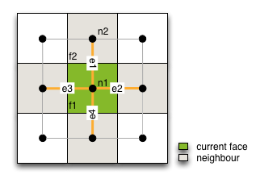

[DanCE4Water Modules](DAnCE4Water.md)
#CreateBlockNetwork

The module links the centres of adjacent faces. 

##Parameter
|        Name       |          Type          |       Description         | 
|-------------------|------------------------|---------------------------|
| BlockNames  | string | name of the faces         |
| CenterNames  | string | name of the centre nodes of the faces      |
| EdgeNames  | string | name of the created edges   |

##Datastream
|     Identifier    |     Attribute    |      Type             |Access |    Description    |
|-------------------|------------------|-----------------------|-------|-------------------|
|[BlockNames] |                  | COMPONENT  | read  |  |
||         neighbourhood       | LINK [BlockNames]  | read  | link to neighbourhood blocks [BlockNames]  |
|[CenterNames] |                  | FACE  | read  |  |
|[EdgeNames] |                  | EDGE  | write  |  |

#Detailed Description
The module creates edges between the centre node of the current block and creates an edge to all adjacent neighbours listed in the neighbourhood attribute. (To create the neighbourhood attribute see e.g. [SearchNeighbourhood](SearchNeighbourhood)). If a link already exists from face e.g. f1 to f2 the module does not create a link from f2 to f1. Therefore the orientation of the created edge doesn't matter. e.g. start node is f1 and end node is f2. This means f1 connected with f2 and the vice versa.

