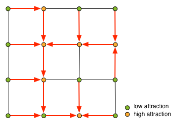
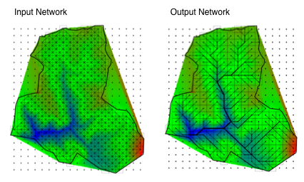

[DanCE4Water Modules](DAnCE4Water.md)
#GravityDrivenNetwork

Based on an indirected graph the module creates a attractor driven tree structured network. The resulting network is a directed graph. The edges are oriented from the less attractive node (start node) to the more attractive node (end node)

##Parameter
|        Name       |          Type          |       Description         | 
|-------------------|------------------------|---------------------------|
| NameInputEdges    | string | name of the input network       |
| NameInputNodes    | string | name of the input nodes       |
| NameOutputNetwork    | string | name of the generate network     |
| ExtendSerachRadius    | int | extended search radius for local maxima     |

##Datastream
|     Identifier    |     Attribute    |      Type             |Access |    Description    |
|-------------------|------------------|-----------------------|-------|-------------------|
| [NameInputEdges] |                  | EDGE   | read  | input network; connected edges share the same node; start and end node are from type [NameInputNodes] |
| [NameInputNodes] |                  | NODE   | read  | nodes of the network |
|                   | attractor  | double | read |  |
| [NameOutputNetwork] |                  | EDGE   | write  | generated network; start and end node are from type[NameInputNodes] |

#Detailed Description
The algorithm starts with the first node in from the [NameInputNodes] and the attractiveness of the current node (attractor attribute). The node is linked to its' neighbouring nodes by edges defined in the [NameInputEdges]. The current node is the start node of a new edge in the generated network, all neighbouring nodes (connected by the [NameInputEdges]) are possible end nodes of this edge. The node is connected to the neighbouring node with the highest attraction. (attractor neighbour node > attractor current node). The end node becomes the new start node. This continues until no attractive neighbouring node can be found. If the current node is such a local maximum the neighbourhood is extended by the value defined in the ExtendSerachRadius. E.g. a search radius of 1 means that the current node can also be connected to the neighbours of its current neighbours. 

As a result the module creates a tree structured network. Leafs are the start nodes (all [NameInputNodes]  nodes) and the roots are local minima that could be connected to another node in the extended neighbourhood.

##Applications

The module is used in DAnCE4Water to connect blocks with their downstream neighbours with a catchment (see figure) As attractor the average elevation (times -1) within a block is used. This resulting network shows a possible drainage flow path throw the blocks. 

