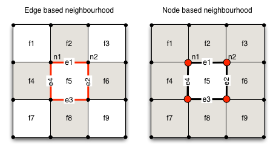

[DanCE4Water Modules](DAnCE4Water.md)
#SearchNeighbourhood

Links adjacent faces as neighbours to the current face. Is designed to work together with the [CityBlock](CityBlock) module.

##Parameter
|        Name       |          Type          |       Description         | 
|-------------------|------------------------|---------------------------|
| BlockNames     | string | name of faces  |
| EdgeNames     | string | name of edges surrounding the face  |
| EdgeBased     | bool | edge or node based neighbourhood search  |

##Datastream
|     Identifier    |     Attribute    |      Type             |Access |    Description    |
|-------------------|------------------|-----------------------|-------|-------------------|
| [BlockNames] |                 | FACE   | read  | faces for neighbourhood search |
|                   | neighbourhood  | LINK ([BlockNames]) | write | link to neighbouring faces |
|                   | neighbours  | double | write | number of adjacent neighbours |
| [EdgeNames] |                 | Edge   | read  | surrounding edges |
|                   | [BlockNames]  | LINK ([BlockNames]) | read | link to face |

#Detailed Description
To identify adjacent neighbours to a face the module requires that adjacent faces share the same surrounding edge. The surrounding edge needs to have a link to its' faces and need to share the same nodes. E.g. in the following figure edge e1 is linked with f2 and f5 and shares the node n1 with edge e4.
To identify the adjacent neighbourhood the module offers two options.

- Edge Based: Faces are adjacent if they share the same edge. On a rectangular grid this corresponds to the [Von Neumann neighbourhood](http://en.wikipedia.org/wiki/Von_Neumann_neighborhood)
- Node Based: Faces are adjacent if they share the same nodes. Do identified a shared node the surrounding are used. Therefore it is required that the surrounding edges share the same nodes if they are connected (see figure). On a rectangular grid the results corresponds with the [Moore neighbourhood](http://en.wikipedia.org/wiki/Moore_neighborhood)

